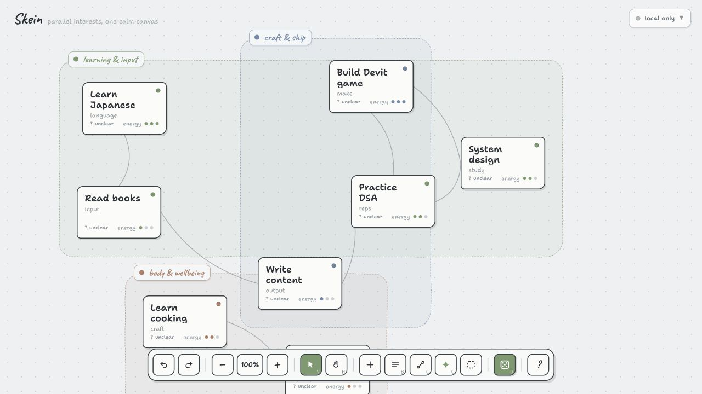
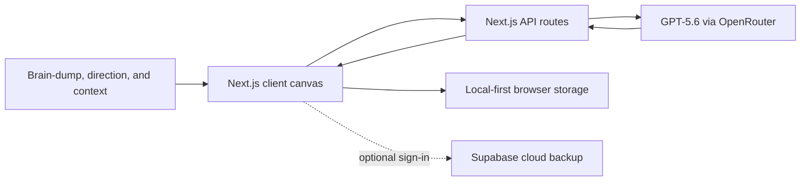

# Skein

### Untangle your parallel interests.

Skein is a calm, spatial canvas for people who want to do many things and freeze when everything feels equally important. Brain-dump the projects, skills, hobbies, and someday-maybes competing for attention. Skein turns them into a connected map, helps each interest find a direction, and gives you one clear next move when choosing feels hard.

[Try the live app](https://skein-phi.vercel.app) · [Open the canvas](https://skein-phi.vercel.app/canvas)

> Built solo by [gadgetfather](https://github.com/gadgetfather) during [**OpenAI Build Week 2026**](https://openai.devpost.com/) for the **Apps for Your Life** track.

[](https://skein-phi.vercel.app/canvas)

## The problem

Traditional task managers assume you already know what matters and how to break it down. That is often the hardest part.

When you care about learning Japanese, shipping a side project, reading more, improving your health, and five other things at once, a longer list creates more pressure—not clarity. Skein is designed for the moment before a task list becomes useful: when your interests are tangled, your goals are still forming, or you simply cannot decide where to begin.

## Inspiration

One of Skein’s conceptual inspirations is the **science roadmap in _Dr. Stone_**: begin with an outcome that feels impossibly far away, work backward through the things it depends on, and reveal a route made of achievable steps.

Skein brings that idea into everyday life. Instead of a fixed roadmap for one invention, each route grows from the user’s own direction, current position, activity, and reference material. The map stays editable because real interests change as the person learns and moves.

## What Skein does

1. **Capture the tangle.** Describe everything on your mind in one messy sentence. GPT‑5.6 separates it into interests, groups related threads, estimates their energy and priority, and suggests useful connections.
2. **See how things relate.** Skein lays those interests out on a draggable canvas. Connect threads manually, let them feed one another, and keep every part of your life visible without forcing it into a rigid hierarchy.
3. **Give one thread direction.** Add where you want to go, where you are now, notes, links, PDFs, or images. GPT‑5.6 turns that context into an editable route of small, ordered moves.
4. **Let Skein choose.** When everything feels important, “decide for me” considers calling, continuity, neglect, available route steps, time, energy, and mood to surface one place to begin.
5. **Start, not just plan.** A chosen move opens a focus session. When you finish, Skein records the work and uses that activity to improve future suggestions.

The first-run walkthrough demonstrates the full loop:

`capture → connect → choose → begin`

## Try it in two minutes

No account or API key is required to test the core experience.

1. Open the [live canvas](https://skein-phi.vercel.app/canvas).
2. Enter several interests in the opening prompt, or choose **explore an example canvas**.
3. Follow the four-step walkthrough.
4. Open an interest and add a direction or current position.
5. Select the dice control and try **just pick for me** or the three-question filter.
6. Reload the page—the canvas remains available through local-first persistence.

The `?` control in the toolbar replays the walkthrough at any time.

## How GPT‑5.6 is integrated

Skein uses **GPT‑5.6 Terra** by default through OpenRouter and the Vercel AI SDK. The model is not a decorative chatbot; it handles the ambiguous reasoning between “I care about this” and “here is a concrete move I can make.”

### 1. Weaving a brain-dump

`POST /api/weave` sends the user’s unstructured brain-dump to GPT‑5.6 with a Zod-enforced structured-output schema. It returns:

- distinct interests;
- clusters such as learning, craft, or wellbeing;
- energy and priority signals;
- a short contextual label for each thread; and
- connections between interests that can reinforce each other.

Skein converts that response into the initial canvas rather than showing the model output as prose.

### 2. Finding one small next move

`POST /api/suggest` combines an interest with its direction, current position, recent sessions, saved route, and—when supplied—current time, energy, and mood. GPT‑5.6 responds with one bounded, verb-first action instead of another broad plan.

### 3. Building a route to clarity

`POST /api/route-map` uses the thread’s desired direction, present state, recent activity, existing moves, and selected source material to generate an editable dependency map. The result preserves ordering and source grounding so the user can see how one small step leads to the next.

### 4. Turning materials into usable context

`POST /api/materials/extract` reduces linked pages, PDFs, and images into bounded factual summaries and excerpts before they enter route generation. Source material is treated as untrusted data, not model instructions.

The model can be changed with `OPENROUTER_MODEL`; the default is `openai/gpt-5.6-terra`.

## How Codex accelerated the build

Skein was started during Build Week, and Codex was used throughout product design, engineering, debugging, and release—not only for isolated code generation.

### Product decisions

- Clarified the core promise from “manage many interests” to “move from paralysis to one meaningful next step.”
- Shaped the direction model so an interest can be unclear, open-ended, or directed instead of forcing every hobby into a conventional goal.
- Designed the route-material system around evidence and context rather than generic AI planning.
- Removed a misleading waitlist interaction that claimed success without storing a submission, replacing it with a direct path into the working product.

### UI and UX iteration

- Simplified the landing-page message and calls to action.
- Improved the visual connections in the canvas preview.
- Made the landing page and canvas responsive across desktop and mobile.
- Added restrained Motion interactions and fixed toolbar/tooltip layout issues.
- Designed and implemented the skippable, replayable four-step walkthrough on top of real product controls.

### Engineering and quality

- Implemented and refined the GPT‑5.6 structured-output endpoints.
- Built living directions, editable route maps, context materials, local-first persistence, and optional Supabase cloud sync.
- Iterated through production builds, browser-based interaction checks, mobile overflow testing, console inspection, and Vercel deployment verification.

The repository’s commit history records this progression from the initial July 20 commit through the deployed walkthrough on July 21.

**Primary Codex build session:** `019f7e86-6ce7-7313-874a-c6bdae093d05`

## Build Week scope

Skein began during OpenAI Build Week. All core product work in this repository was completed during the submission period, including:

- the spatial interest canvas and onboarding weave;
- GPT‑5.6 brain-dump, next-move, route-map, and material-extraction flows;
- the decision engine and focus sessions;
- living directions and route progress;
- local-first storage and optional cloud synchronization;
- responsive landing and canvas experiences;
- the product walkthrough; and
- production deployment.

## Architecture



The canvas remains usable without an account or model key. AI endpoints return `503` when `OPENROUTER_API_KEY` is absent, and the client uses local fallbacks. User canvas data stays in the browser unless the user explicitly enables Supabase sync; only context needed for an AI request is sent to the configured model provider.

## Tech stack

- Next.js 16 and React 19
- Tailwind CSS v4
- Motion
- Vercel AI SDK and OpenRouter
- GPT‑5.6 Terra
- Zod structured outputs
- Supabase Auth, Postgres, Storage, and RLS for optional sync
- Vercel deployment

## Run locally

### Prerequisites

- Node.js 20 or newer
- npm
- An OpenRouter API key for GPT‑5.6 features (optional)

```bash
git clone https://github.com/gadgetfather/skein.git
cd skein
npm install
cp .env.example .env.local
npm run dev
```

Open [http://localhost:3000](http://localhost:3000).

To enable GPT‑5.6, add this to `.env.local`:

```bash
OPENROUTER_API_KEY=your_openrouter_key
OPENROUTER_MODEL=openai/gpt-5.6-terra
```

Validate a production build with:

```bash
npm run build
npm start
```

## Optional Supabase cloud save

Skein saves locally first and works without an account. To enable passwordless sign-in and cloud backup:

1. Create a Supabase project.
2. Apply the migrations in `supabase/migrations` in timestamp order, or link the Supabase CLI and run `supabase db push`.
3. Add the following browser-safe values to `.env.local`:

   ```bash
   NEXT_PUBLIC_SUPABASE_URL=https://your-project.supabase.co
   NEXT_PUBLIC_SUPABASE_PUBLISHABLE_KEY=sb_publishable_your_key
   ```

4. Add `http://localhost:3000/canvas` and the production `/canvas` URL to the allowed redirect URLs in Supabase Authentication.
5. Restart the development server and use the **local only** control in the canvas.

The migrations create one private JSON canvas document per user, enable row-level security, and apply owner-only database and Storage policies. Never expose a Supabase `service_role` key through a `NEXT_PUBLIC_*` variable.

## Project structure

- `src/app/` — landing page, canvas routes, design reference, and AI API endpoints
- `src/App.jsx` — canvas state, interaction logic, and rendering
- `src/ui/` — onboarding, toolbar, walkthrough, decisions, details, routes, focus, and sync surfaces
- `src/lib/ai.js` — GPT‑5.6 provider and model configuration
- `src/lib/canvas-document.js` — versioned local/cloud canvas document helpers
- `src/lib/supabase/` — browser client and local-first sync orchestration
- `supabase/migrations/` — database, RLS, and private Storage policies
- `design/` — original visual explorations retained as design provenance

## Current status

Skein is a working Build Week prototype deployed on Vercel. The core capture-to-action loop, AI routes, local persistence, and optional cloud save are functional. It is not intended to provide medical or mental-health advice; its purpose is to reduce everyday planning friction and help users take a manageable next step.

## Design provenance and third-party tools

The interface was implemented from the project’s original [Claude Design exploration](https://claude.ai/design/p/eb47ef53-57ca-4ded-a64e-35c29eea63f5), created during the same Build Week process and retained under `design/` for reference. Skein also uses the open-source frameworks and SDKs listed in the tech stack above; their respective licenses are available in their linked packages and dependency metadata.
